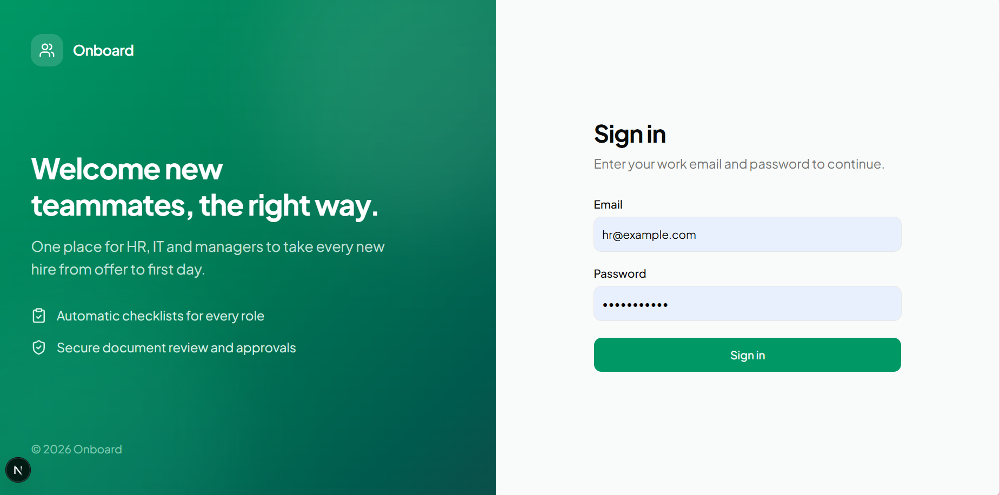
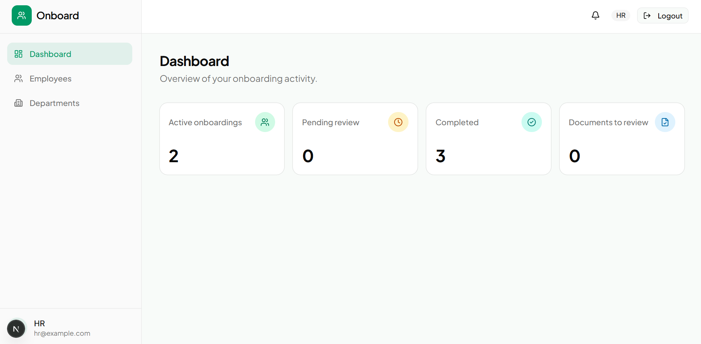
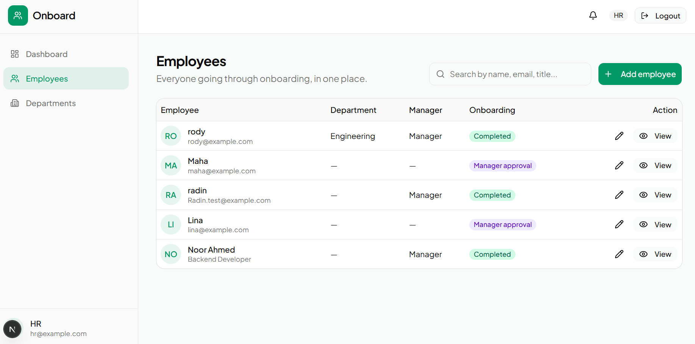
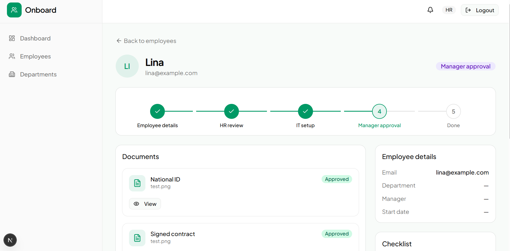
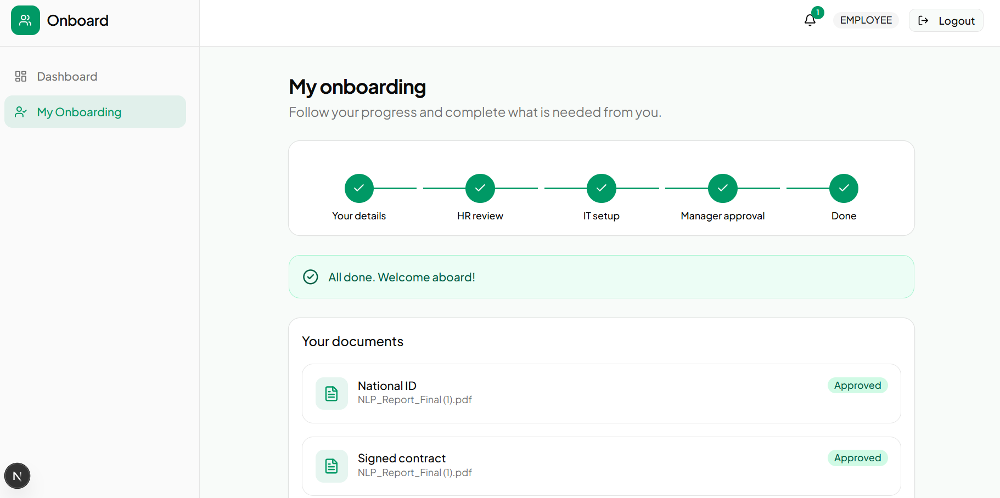
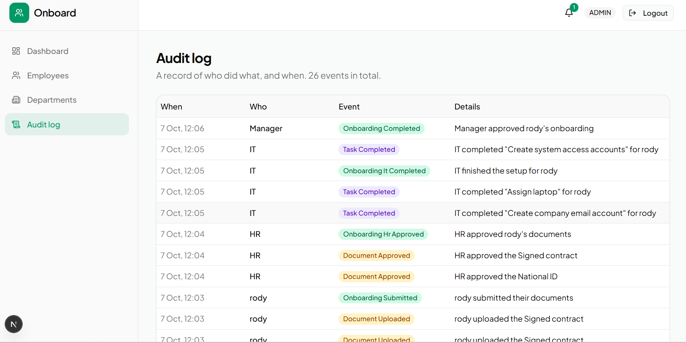

# Onboard: Frontend

Web app for an employee onboarding system. HR, IT, managers and new hires each get their own view of the same workflow, from the first day of paperwork to final approval.

🔗 **Backend repository:** [onboarding-system](https://github.com/Radi1n/onboarding-system)
🚀 **Live demo:** _coming soon_



## Highlights

- **Role-aware interface.** The sidebar, pages and actions change with the signed-in role.
- **Clear progress.** A step tracker shows exactly where each onboarding stands.
- **Document review.** HR previews files, approves or rejects with a reason, and the employee sees the feedback.
- **Notifications.** A bell with an unread counter, refreshed automatically.
- **Audit log.** Admins can see who did what, and when.
- **Polished details.** Loading skeletons, empty states, inline errors and confirmation dialogs.

## Screenshots

| Dashboard | Employees |
|---|---|
|  |  |

| HR review | Employee view |
|---|---|
|  |  |



## Tech stack

Next.js 16 (App Router), React, TypeScript, Tailwind CSS v4, shadcn/ui, Lucide icons

## Getting started

You need the [backend API](https://github.com/Radi1n/onboarding-system) running first.

```bash
git clone https://github.com/Radi1n/onboarding-frontend.git
cd onboarding-frontend
npm install
```

Create a `.env.local` file:

```env
NEXT_PUBLIC_API_URL=http://127.0.0.1:8000/api
```

Then start the app:

```bash
npm run dev
```

Open [http://localhost:3000/login](http://localhost:3000/login). The demo accounts are listed in the backend README.

## Project structure

```
app/                 Pages (login, dashboard, employees, onboardings/[id], ...)
components/          App shell, notification bell, dialogs, step tracker
components/ui/       shadcn/ui primitives
lib/api.ts           Fetch helper that attaches the auth token
```

## Notes

The auth token is kept in `localStorage`, which is fine for a portfolio project. A production app would use `httpOnly` cookies instead.